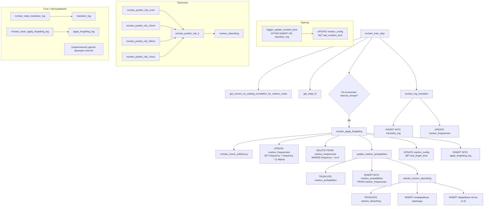
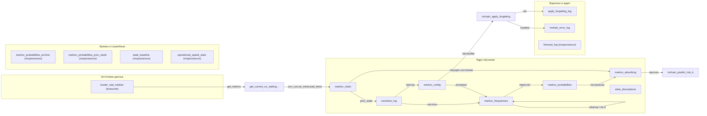

# Цепь Маркова для прогнозирования аварийных ситуаций

[](https://www.postgresql.org/)
[](https://github.com/your-repo/markov-chain)
[](LICENSE)

**Реализация цепи Маркова с онлайн-обучением** для прогнозирования инцидентов (аварий) на основе трёх потоковых метрик производительности:  
`корреляция`, `тренд операционной скорости`, `тренд времени ожидания`.

Модель обучается каждую минуту, адаптивно забывает устаревшие паттерны и выдаёт прогноз риска на 1, 15, 30 и 60 минут с использованием поглощающей цепи Маркова.

---

## Содержание

- [Общее описание](#общее-описание)
- [Основные возможности](#основные-возможности)
- [Архитектура](#архитектура)
  - [Граф вызовов функций](#граф-вызовов-функций)
  - [Граф взаимодействия таблиц](#граф-взаимодействия-таблиц)
- [Кодирование состояний](#кодирование-состояний)
- [Конфигурация](#конфигурация)
- [Ключевые функции](#ключевые-функции)
  - [mchain_train_step – Минутное обучение](#mchain_train_step--минутное-обучение)
  - [Механизм обучения цепи Маркова](#механизм-обучения-цепи-маркова)
  - [Адаптивное забывание](#адаптивное-забывание)
  - [Оценка достоверности прогнозов](#оценка-достоверности-прогнозов)
  - [Управление забыванием](#управление-забыванием)
- [Прогнозирование риска](#прогнозирование-риска)
- [Обслуживание (Cron)](#обслуживание-cron)
- [Мониторинг и диагностика](#мониторинг-и-диагностика)
- [Лицензия](#лицензия)

---

## Общее описание

Данная реализация цепи Маркова предназначена для **прогнозирования аварийного состояния** (инцидента) системы на основе трёх потоковых метрик:

- **Текущая корреляция** между операционной скоростью и временем ожидания (`correlation`).
- **Тренд операционной скорости** (`os_trend`): −1 (падение), 0 (стабильно), +1 (рост).
- **Тренд времени ожидания** (`wait_trend`): −1, 0, +1.

Комбинация (округлённая корреляция с шагом 0.1 + два тренда) образует **189 дискретных состояний** (от −1.0 до +1.0). Справочник `state_descriptions` заполняется один раз функцией `fill_state_descriptions()`.

Модель работает в **режиме онлайн‑обучения**:

- Каждую минуту вызывается корневая функция `mchain_train_step()`.
- Она получает свежие метрики из таблицы `cluster_stat_median` (через вспомогательную функцию `get_current_os_waiting_correlation_for_markov_chain`), определяет текущее состояние и логирует переход `(предыдущее → текущее)`.
- Частоты переходов накапливаются в таблице `markov_frequencies`.
- Периодически (по расписанию или при превышении порога) применяется **адаптивное забывание**, чтобы модель отслеживала дрейф поведения системы.
- По текущей матрице вероятностей строятся **прогнозы риска** на 1, 15, 30 минут и 1 час с использованием поглощающей цепи Маркова.
- **Триггер `trigger_update_incident_time`** автоматически обновляет `markov_config.last_incident_time` при каждом аварийном переходе (состояние с `correlation < 0 AND os_trend = -1`). Это обеспечивает динамическую настройку коэффициента забывания.

Средняя частота реальных инцидентов (аварийных переходов) составляет **≈1 событие в день**, что учитывается при динамическом расчёте коэффициента забывания.

---

## Основные возможности

- **Онлайн‑обучение** – одно новое наблюдение в минуту, без периодического переобучения.
- **Адаптивное забывание** – коэффициент забывания `α` зависит от времени, прошедшего с последнего инцидента (экспоненциальное затухание с настраиваемым периодом полураспада).
- **Поглощающая цепь** – аварийные состояния становятся поглощающими, что позволяет вычислять вероятность хотя бы одного инцидента за K шагов.
- **Диагностика достаточности** – проверка объёма данных и стабильности вероятностей перед включением забывания (функция `mchain_check_sufficiency`).
- **Прогнозные функции** – готовые обёртки для горизонтов 1, 15, 30, 60 минут.
- **Оценка достоверности прогнозов** – функции `mchain_forecast_reliability` (рейтинг 0–5) и `mchain_reliability_report` (развёрнутый отчёт).
- **Полное журналирование** – логи ошибок, вызовов забывания, архивов матриц.

---

## Архитектура

### Граф вызовов функций



**Примечания:**

- `mchain_train_step` – единственная функция, запускаемая **каждую минуту** (например, из внешнего планировщика, который вызывает `performance_metrics`).
- Функция `get_current_os_waiting_correlation_for_markov_chain` обращается к таблице `cluster_stat_median` (внешней по отношению к представленному DDL).
- Адаптивное забывание инициируется **только** из `mchain_train_step` при достижении `interval_minute` (по умолчанию 30 минут) и только если `adaptive_forgetting_enabled = true`.
- Прогнозные функции (`mchain_predict_risk_*`) вызываются по требованию, они не влияют на обучение.
- Триггер `trigger_update_incident_time` автоматически обновляет время последнего инцидента при каждом аварийном переходе.

### Граф взаимодействия таблиц



**Основные потоки:**

1. **Обучение** (минутное): `cluster_stat_median` → `get_current_os_waiting...` → `markov_chain` → `transition_log` → `markov_frequencies`.
2. **Пересчёт вероятностей** (при забывании или вручную): `markov_frequencies` → `markov_probabilities` → `markov_absorbing`.
3. **Адаптивное забывание**: читает `markov_config`, обновляет `markov_frequencies`, логирует в `apply_forgetting_log`.
4. **Прогнозирование риска**: читает `markov_absorbing` и текущее состояние из `markov_chain` (или через `get_current_os_waiting...`).
5. **Обслуживание (cron)**: очистка `transition_log` и `apply_forgetting_log`.

---

## Кодирование состояний

Каждое состояние кодируется числом `state_id` от 0 до 188 по формуле:

```
state_id = (index_correlation * 9) + ((os_trend + 1) * 3) + (wait_trend + 1)
```

где `index_correlation = round((correlation + 1.0) / 0.1)` → от 0 до 20.

Функция `get_state_id(correlation, os_trend, wait_trend)` возвращает этот идентификатор и используется везде для отображения метрик → состояние.  
Таблица `state_descriptions` содержит все 189 комбинаций и заполняется однократно `fill_state_descriptions()`.

---

## Конфигурация

Все параметры хранятся в таблице `markov_config` (одна строка). Основные настройки:

| Параметр | Значение по умолчанию | Описание |
|----------|----------------------|----------|
| `adaptive_forgetting_enabled` | `true` | Глобальное включение забывания |
| `use_adaptive_alpha` | `true` | Адаптивный расчёт `alpha` (иначе фиксированное `alpha`) |
| `base_alpha` | 0.1 | Базовый коэффициент забывания |
| `min_alpha` | 0.01 | Минимально возможный `alpha` |
| `incident_half_life_days` | 7.0 | Период полураспада веса инцидента (дни) |
| `interval_minute` | 30 | Забывание применяется не чаще 1 раза в 30 минут |
| `min_transitions_for_forgetting` | 5000 | Пока общее число переходов ниже порога, забывание не выполняется |
| `transition_log_retention_days` | 21 | Срок хранения записей в `transition_log` |
| `apply_forgetting_log_retention_days` | 21 | Срок хранения журнала забывания |

Изменить параметры можно обычным `UPDATE markov_config SET ...`.

---

## Ключевые функции

### `mchain_train_step` – Минутное обучение

Вызывается **каждую минуту**. Выполняет:

1. Получение текущих метрик (корреляция, тренды) из `get_current_os_waiting_correlation_for_markov_chain`.
2. Определение `state_id` текущего состояния.
3. Чтение предыдущего состояния из `markov_chain`.
4. Логирование перехода в `transition_log` и обновление `markov_frequencies` (через `mchain_log_transition`).
5. Обновление строки в `markov_chain` (сдвиг состояний).
6. Если с последнего забывания прошло `interval_minute` минут – вызов `mchain_apply_forgetting()`.

**Возвращает** текстовый статус (для отладки). В случае ошибок – логирует в `mchain_error_log`, но не прерывает работу.

### Механизм обучения цепи Маркова

Обучение происходит автоматически через накопление частот:

- Каждый переход увеличивает `frequency` в `markov_frequencies` на 1.0.
- Периодически (при забывании или вручную) вызывается `update_markov_probabilities()`, которая пересчитывает условные вероятности:

  ```sql
  INSERT INTO markov_probabilities
  SELECT from_state, to_state,
         frequency / SUM(frequency) OVER (PARTITION BY from_state)
  FROM markov_frequencies;
  ```

- На основе `markov_probabilities` строится поглощающая матрица `markov_absorbing`, где аварийные состояния (`correlation < 0 AND os_trend = -1`) имеют только петлю с вероятностью 1.0 (функция `rebuild_markov_absorbing`).

### Адаптивное забывание

Функция `mchain_apply_forgetting(alpha_override REAL DEFAULT NULL)` реализует алгоритм:

1. Проверяет `adaptive_forgetting_enabled` и достаточность данных через `mchain_check_sufficiency()`.
2. Вычисляет эффективный `alpha`:
   - Если передан `alpha_override` – используется он.
   - Иначе если `use_adaptive_alpha`:
     - При отсутствии `last_incident_time` → `min_alpha`.
     - Иначе `days_since = (now() - last_incident_time) / 86400`
       `alpha = base_alpha * exp(-days_since / incident_half_life_days)`
       `alpha = GREATEST(alpha, min_alpha)`
   - Иначе фиксированное `alpha` из конфига.
3. Применяет забывание:
   ```sql
   UPDATE markov_frequencies SET frequency = frequency * (1.0 - effective_alpha);
   DELETE FROM markov_frequencies WHERE frequency < 1e-6;
   PERFORM update_markov_probabilities();
   UPDATE markov_config SET last_forget_time = now();
   ```
4. Логирует вызов в `apply_forgetting_log`.

**Функция `mchain_check_sufficiency`** проверяет, достаточно ли накоплено данных для безопасного забывания:
- Общее число переходов ≥ `min_transitions_for_forgetting` (по умолчанию 5000).
- Если данных достаточно (≥ 10000), дополнительно проверяется стабильность вероятностей за последние две недели: максимальное изменение вероятностей любого перехода не должно превышать `max_prob_change` (по умолчанию 0.05).

**Триггер `trigger_update_incident_time`** автоматически обновляет `markov_config.last_incident_time` при каждом аварийном переходе (попадании в состояние с `correlation < 0 AND os_trend = -1`). Это обеспечивает динамическую настройку `alpha` на основе реальной аварийности.

### Оценка достоверности прогнозов

- **`mchain_forecast_reliability()`** – возвращает целочисленный рейтинг от 0 до 5:
  - 0: менее 100 переходов – модель не обучена.
  - 1: 100–499 переходов – очень мало данных.
  - 2: 500–4999 переходов – недостаточно данных.
  - 3: ≥5000 переходов – минимально достаточный уровень (базовая оценка).
  - 4, 5: добавляются бонусы за стабильность вероятностей (изменение <0.05) и покрытие частых состояний (>90%).
- **`mchain_reliability_report()`** – возвращает развёрнутый текстовый отчёт, включающий:
  - Общий рейтинг и его интерпретацию.
  - Количество переходов, порог `min_transitions_for_forgetting`.
  - Максимальное изменение вероятностей за 14 дней (если данных ≥5000).
  - Процент покрытия частых состояний (состояния с частотой >1% должны иметь ≥50 переходов).
  - Рекомендации по улучшению достоверности.

### Управление забыванием

- **`mchain_enable_forgetting_when_sufficient()`** – включает адаптивное забывание (`adaptive_forgetting_enabled = true`) только если `mchain_check_sufficiency()` возвращает `true`. Возвращает текстовый статус.
- **`mchain_force_enable_forgetting()`** – принудительно включает забывание (без проверки достаточности). Полезно для ручного вмешательства.

---

## Прогнозирование риска

Доступны следующие функции:

- `mchain_predict_risk_1min()` – риск на следующую минуту (1 шаг).
- `mchain_predict_risk_15min()` – риск на 15 минут (15 шагов).
- `mchain_predict_risk_30min()` – риск на 30 минут.
- `mchain_predict_risk_1hour()` – риск на 60 минут.

Все они возвращают таблицу:

| Колонка | Тип | Описание |
|---------|-----|----------|
| `risk` | REAL | Вероятность хотя бы одного попадания в аварию за горизонт |
| `curr_situation` | TEXT | `'unknown_state'`, `'no_risk'`, `'risk_calculated'` |
| `curr_transitions_to_risk` | BIGINT | Число известных переходов из текущего состояния в аварию |
| `curr_total_transitions_known` | BIGINT | Общее число известных переходов из текущего состояния |

Внутри используется `mchain_predict_risk_k(k INT)`, которая:

- Определяет текущее состояние (или возвращает априорную оценку `risk = 1 - (1-0.05)^k` при неизвестном состоянии).
- Инициализирует вектор распределения длины 189 единицей в текущем состоянии.
- Умножает вектор на матрицу `markov_absorbing` `k` раз.
- Суммирует вероятности аварийных состояний – это и есть итоговый риск.

---

## Обслуживание (Cron)

Рекомендуемые cron-задачи для поддержания базы данных:

| Время | Команда | Назначение |
|-------|---------|-------------|
| `15 1 * * *` | `SELECT mchain_clean_transition_log();` | Удаляет записи `transition_log` старше `transition_log_retention_days` (по умолчанию 21 день) |
| `0 2 * * *` | `SELECT mchain_clean_apply_forgetting_log();` | Очищает `apply_forgetting_log` старше `apply_forgetting_log_retention_days` (21 день) |

**Примечание:** В поставку включены только эти две функции очистки. При необходимости вы можете добавить собственные cron-задачи, например:
- Еженедельный снимок матрицы вероятностей (`INSERT INTO markov_probabilities_prev_week SELECT ... FROM markov_probabilities`).
- Очистка `forecast_log`, если вы его ведёте.
- Обновление эталонных статистик (`mchain_update_baseline`, `mchain_refresh_os_stats`).

---

## Мониторинг и диагностика

### Оценка достоверности прогнозов

- `mchain_forecast_reliability()` возвращает рейтинг от 0 до 5 (подробнее см. раздел [Оценка достоверности прогнозов](#оценка-достоверности-прогнозов)).
- `mchain_reliability_report()` выдаёт развёрнутый текстовый отчёт с метриками, порогами и рекомендациями.

### Просмотр ошибок

Таблица `mchain_error_log` содержит все ошибки, возникшие при работе функций (с контекстом в JSONB). Пример запроса:
```sql
SELECT ts, function_name, error_message, context
FROM mchain_error_log
ORDER BY ts DESC
LIMIT 20;
```

### Отслеживание забывания

В `apply_forgetting_log` фиксируется каждый вызов `mchain_apply_forgetting` с указанием применённого `alpha`, количества дней с последнего инцидента и деталей расчёта.

### Ручное управление забыванием

- `mchain_enable_forgetting_when_sufficient()` – включает адаптивное забывание только после проверки достаточности данных.
- `mchain_force_enable_forgetting()` – принудительное включение (без проверки).

---

## Лицензия

MIT License. Подробности в файле [LICENSE](LICENSE).

---

**Вопросы и обратная связь** – создавайте Issues в репозитории GitHub.
