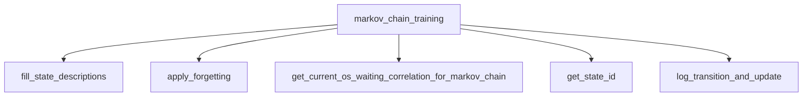

# Реализация цепи Маркова для прогнозирования инцидентов производительности СУБД PostgreSQL 

## Граф вызовов функций

```mermaid
graph TD
  update_markov_frequency --> get_state_id
  log_transition_and_update --> get_state_id
  log_transition_and_update --> update_markov_frequency
  update_markov_probabilities --> rebuild_markov_absorbing
  predict_risk_1min --> get_current_os_waiting_correlation_for_markov_chain
  predict_risk_1min --> get_state_id
  predict_risk_k_diag --> get_current_os_waiting_correlation_for_markov_chain
  predict_risk_k_diag --> get_state_id
  snapshot_markov_prev_week --> archive_markov_probabilities
  check_kl_divergence --> get_stationary_distribution
  evaluate_training_sufficiency --> compare_brier_scores
  evaluate_training_sufficiency --> check_kl_divergence
  apply_forgetting --> update_markov_probabilities
  check_and_forget --> calculate_kl_divergence
  check_and_forget --> calculate_chi_squared
  check_and_forget --> get_os_deviation
  check_and_forget --> apply_forgetting
  emergency_forget --> apply_forgetting
  markov_chain_training --> fill_state_descriptions
  markov_chain_training --> apply_forgetting
  markov_chain_training --> get_current_os_waiting_correlation_for_markov_chain
  markov_chain_training --> get_state_id
  markov_chain_training --> log_transition_and_update

  class markov_chain_training highlight
  classDef highlight fill:#ffcccb,stroke:#f00,stroke-width:4px,color:#a00,font-weight:bold
```

## Корневая функция "markov_chain_training"

Вызывается при расчете ежеминутных данных операционной скорости и ожиданий в функции **performance_metrics**

# Функция `markov_chain_training()`

## 📌 Назначение

**Ядро непрерывного обучения цепи Маркова.**  
Функция вызывается **каждую минуту** (в функции **performance_metrics**) и выполняет:

- Плановое забывание устаревших данных (адаптация к изменению нагрузки)
- Сбор актуальных метрик системы (корреляция, тренды)
- Сдвиг и сохранение состояний (`prev` → `curr`)
- Вычисление прогноза риска аварии на следующую минуту
- Логирование прогноза и фактического исхода
- Обновление матрицы частот переходов

Функция не принимает параметров и не возвращает значений (всё состояние хранится в таблицах).

---

## ⚙️ Алгоритм работы (по шагам)

### 1. Инициализация справочника состояний
```sql
SELECT EXISTS (SELECT 1 FROM state_descriptions) INTO ...
IF NOT ... THEN PERFORM fill_state_descriptions();
```
При первом вызове (или если таблица `state_descriptions` пуста) автоматически заполняется справочник из **189 состояний** (комбинации корреляции, тренда операционной скорости и тренда ожиданий).

### 2. Плановое забывание (адаптация)
```sql
SELECT last_forget_time, alpha, MAKE_INTERVAL(mins => interval_minute)
INTO last_forget, forget_alpha, forget_interval FROM markov_config;
```
Читает настройки из `markov_config`. Если с момента последнего забывания прошло больше `interval_minute` минут, вызывает `apply_forgetting()`, которая:
- уменьшает все частоты в `markov_frequencies` на коэффициент `alpha`
- удаляет пренебрежимо малые частоты
- перестраивает матрицы вероятностей и поглощения

### 3. Сбор текущих метрик
```sql
SELECT * INTO new_values_rec
FROM get_current_os_waiting_correlation_for_markov_chain();
```
Вызывает функцию, которая за последний час вычисляет:
- `current_correlation` (корреляция между операционной скоростью и ожиданиями)
- `current_os_trend`  (направление тренда скорости: -1, 0, +1)
- `current_wait_trend` (направление тренда ожиданий)

### 4. Работа с таблицей `markov_chain` (однострочное состояние)
Таблица `markov_chain` хранит одно состояние системы:
- `prev_correlation`, `prev_os_trend`, `prev_wait_trend` – состояние на прошлой минуте
- `curr_correlation`, `curr_os_trend`, `curr_wait_trend` – состояние на текущей минуте

**Первое измерение (инициализация):**  
Если запись пуста (`prev_correlation IS NULL`), то вставляется только текущее состояние (и `prev` = `curr`), функция завершается.

**Обычный цикл:**  
Старое `curr` становится `prev`, а новые метрики записываются в `curr`.

### 5. Идентификация состояний через `get_state_id()`
```sql
prev_state := get_state_id(...);
curr_state := get_state_id(...);
```
Преобразует тройки `(correlation, os_trend, wait_trend)` в целочисленный `state_id` от 0 до 188.

### 6. Прогноз риска на 1 минуту вперёд
```sql
SELECT COALESCE(SUM(probability), 0.0) INTO risk_pred
FROM markov_probabilities
WHERE from_state = prev_state
  AND to_state IN (SELECT state_id FROM state_descriptions
                   WHERE correlation < 0 AND os_trend = -1);
```
Суммирует вероятности перехода из `prev_state` во все **аварийные состояния** (отрицательная корреляция и падающая операционная скорость).  
Если в матрице нет записей – `risk_pred = 0`.

### 7. Определение фактического исхода (`actual_risk`)
```sql
SELECT CASE WHEN correlation < 0 AND os_trend = -1 THEN 1 ELSE 0 END INTO actual
FROM state_descriptions WHERE state_id = curr_state;
```
`actual = 1`, если текущее состояние аварийное, иначе 0.

### 8. Логирование прогноза в `forecast_log`
```sql
INSERT INTO forecast_log (ts, model_train_date, predicted_risk, actual_risk, from_state, to_state)
VALUES (now(), current_date, risk_pred, actual, prev_state, curr_state);
```
Сохраняется:
- метка времени
- дата обучения (текущая дата)
- предсказанный риск
- фактический исход
- идентификаторы состояний

### 9. Обновление матрицы частот переходов
```sql
PERFORM log_transition_and_update(
    prev_correlation, prev_os_trend, prev_wait_trend,
    curr_correlation, curr_os_trend, curr_wait_trend
);
```
Эта функция:
- записывает переход в `transition_log`
- увеличивает счётчик `frequency` в `markov_frequencies` для пары `(from_state, to_state)`

---

## 📂 Используемые таблицы и представления

| Таблица / функция | Роль |
|------------------|------|
| `state_descriptions` | Справочник 189 состояний (корреляция, тренды) |
| `markov_config` | Конфигурация: `alpha`, `interval_minute`, `last_forget_time` |
| `markov_chain` | Хранит предыдущее и текущее состояние системы (одна строка) |
| `markov_probabilities` | Матрица вероятностей переходов (нормализованные частоты) |
| `forecast_log` | Журнал прогнозов и фактических исходов |
| `markov_frequencies` | Сырые частоты переходов |
| `get_current_os_waiting_correlation_for_markov_chain()` | Функция получения метрик за последний час |
| `fill_state_descriptions()` | Заполнение справочника (вызывается один раз) |
| `apply_forgetting()` | Плановое забывание (по таймеру) |
| `log_transition_and_update()` | Логирование перехода и обновление частот |

---

## 🔁 Зависимости (вызываемые функции)



---

## ⚠️ Важные замечания

- **Первое выполнение** – только инициализирует `markov_chain` и `state_descriptions`, не обновляет частоты.
- **Плановое забывание** – управляется параметрами `alpha` и `interval_minute` в `markov_config`.  
  Если `use_adaptive_alpha = true`, то `alpha` динамически уменьшается после инцидентов.
- **Прогноз** – основывается на матрице `markov_probabilities`, которая автоматически обновляется через `apply_forgetting()`.
- **Аварийные состояния** – задаются жёстко: `correlation < 0 AND os_trend = -1`.
- **Логирование** – `forecast_log` растёт быстро, рекомендуется настроить очистку (см. `clean_forecast_log()`).

---

## 🛠️ Сопровождение

- **Очистка** – для `forecast_log` и `transition_log` предусмотрены фоновые процедуры (по cron).
- **Мониторинг** – используйте `evaluate_training_sufficiency()` для проверки зрелости модели.
- **Ручное забывание** – вызов `emergency_forget('manual', 0.3)` для немедленного сброса.

---

## 📈 Поток данных (кратко)

1. **Системные метрики** → `get_current_os_waiting_correlation_for_markov_chain()`
2. **Состояние** → `markov_chain` (сдвиг prev/curr)
3. **Прогноз** → `markov_probabilities` (сумма вероятностей в аварийные состояния)
4. **Факт** → определение аварийности текущего состояния
5. **Лог** → `forecast_log`
6. **Обучение** → `markov_frequencies` (инкремент частоты перехода)

---

## 📄 Связанные функции

- `predict_risk_1min()` – получить текущий прогноз риска (без обучения)
- `predict_risk_k_diag(int k)` – риск за K шагов с поглощающей цепью
- `update_markov_probabilities()` – пересчёт вероятностей из частот
- `check_and_forget()` – форсированное забывание при обнаружении дрейфа

---

*Документация актуальна для версии 10.0 `markov_chain_functions.sql`.*


