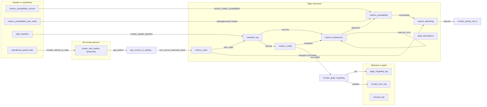

# Цепь Маркова для прогнозирования аварийных ситуаций

[](https://www.postgresql.org/)
[](https://github.com/your-repo/markov-chain)
[](LICENSE)

**Реализация цепи Маркова с онлайн-обучением** для прогнозирования инцидентов (аварий) на основе трёх потоковых метрик производительности:  
`корреляция`, `тренд операционной скорости`, `тренд времени ожидания`.

Модель обучается каждую минуту, адаптивно забывает устаревшие паттерны и выдаёт прогноз риска на 1, 15, 30 и 60 минут с использованием поглощающей цепи Маркова.

---

## Содержание

- [Общее описание](#общее-описание)
- [Основные возможности](#основные-возможности)
- [Архитектура](#архитектура)
  - [Граф вызовов функций](#граф-вызовов-функций)
  - [Граф взаимодействия таблиц](#граф-взаимодействия-таблиц)
- [Кодирование состояний](#кодирование-состояний)
- [Установка и настройка](#установка-и-настройка)
- [Конфигурация](#конфигурация)
- [Ключевые функции](#ключевые-функции)
  - [mchain_train_step – Минутное обучение](#mchain_train_step--минутное-обучение)
  - [Механизм обучения цепи Маркова](#механизм-обучения-цепи-маркова)
  - [Адаптивное забывание](#адаптивное-забывание)
- [Прогнозирование риска](#прогнозирование-риска)
- [Обслуживание (Cron)](#обслуживание-cron)
- [Мониторинг и диагностика](#мониторинг-и-диагностика)
- [Лицензия](#лицензия)

---

## Общее описание

Данная реализация цепи Маркова предназначена для **прогнозирования аварийного состояния** (инцидента) системы на основе трёх потоковых метрик:

- **Текущая корреляция** между операционной скоростью и временем ожидания (`correlation`).
- **Тренд операционной скорости** (`os_trend`): −1 (падение), 0 (стабильно), +1 (рост).
- **Тренд времени ожидания** (`wait_trend`): −1, 0, +1.

Комбинация (округлённая корреляция с шагом 0.1 + два тренда) образует **189 дискретных состояний** (от −1.0 до +1.0). Справочник `state_descriptions` заполняется один раз функцией `fill_state_descriptions()`.

Модель работает в **режиме онлайн‑обучения**:

- Каждую минуту вызывается корневая функция `mchain_train_step()`.
- Она получает свежие метрики из таблицы `cluster_stat_median` (через вспомогательную функцию `get_current_os_waiting_correlation_for_markov_chain`), определяет текущее состояние и логирует переход `(предыдущее → текущее)`.
- Частоты переходов накапливаются в таблице `markov_frequencies`.
- Периодически (по расписанию или при превышении порога) применяется **адаптивное забывание**, чтобы модель отслеживала дрейф поведения системы.
- По текущей матрице вероятностей строятся **прогнозы риска** на 1, 15, 30 минут и 1 час с использованием поглощающей цепи Маркова.

Средняя частота реальных инцидентов (аварийных переходов) составляет **≈1 событие в день**, что учитывается при динамическом расчёте коэффициента забывания.

---

## Основные возможности

- **Онлайн‑обучение** – одно новое наблюдение в минуту, без периодического переобучения.
- **Адаптивное забывание** – коэффициент забывания `α` зависит от времени, прошедшего с последнего инцидента (экспоненциальное затухание с настраиваемым периодом полураспада).
- **Поглощающая цепь** – аварийные состояния становятся поглощающими, что позволяет вычислять вероятность хотя бы одного инцидента за K шагов.
- **Диагностика достаточности** – проверка объёма данных и стабильности вероятностей перед включением забывания.
- **Прогнозные функции** – готовые обёртки для горизонтов 1, 15, 30, 60 минут.
- **Полное журналирование** – логи ошибок, вызовов забывания, архивов матриц.

---

## Архитектура

### Граф вызовов функций

```mermaid
flowchart TD
    A[mchain_train_step] --> B[get_current_os_waiting_correlation_for_markov_chain]
    A --> C[get_state_id]
    A --> D[mchain_log_transition]
    A --> E{По истечении interval_minute?}
    E -->|Да| F[mchain_apply_forgetting]

    D --> G["INSERT INTO transition_log"]
    D --> H["UPDATE markov_frequencies"]

    F --> I[mchain_check_sufficiency]
    F --> J["UPDATE markov_frequencies\nSET frequency = frequency * (1-alpha)"]
    F --> K["DELETE FROM markov_frequencies\nWHERE frequency < 1e-6"]
    F --> L[update_markov_probabilities]
    F --> M["UPDATE markov_config\nSET last_forget_time"]
    F --> N["INSERT INTO apply_forgetting_log"]

    L --> O["TRUNCATE markov_probabilities"]
    L --> P["INSERT INTO markov_probabilities\nFROM markov_frequencies"]
    L --> Q[rebuild_markov_absorbing]

    Q --> R["TRUNCATE markov_absorbing"]
    Q --> S["INSERT неаварийные переходы"]
    Q --> T["INSERT аварийные петли (1.0)"]

    subgraph Триггер
        U["trigger_update_incident_time\nAFTER INSERT ON transition_log"] --> V["UPDATE markov_config\nSET last_incident_time"]
    end

    subgraph Прогнозы
        W[mchain_predict_risk_1min] --> X[mchain_predict_risk_k]
        Y[mchain_predict_risk_15min] --> X
        Z[mchain_predict_risk_30min] --> X
        AA[mchain_predict_risk_1hour] --> X
        X --> markov_absorbing
    end

    subgraph Cron / обслуживание
        BB[mchain_clean_transition_log] --> transition_log
        CC[mchain_clean_forecast_log] --> forecast_log
        DD[mchain_clean_archive] --> markov_probabilities_archive
        EE[mchain_update_baseline] --> state_baseline
        FF[mchain_refresh_os_stats] --> operational_speed_stats
    end
```



**Примечания:**

- `mchain_train_step` – единственная функция, запускаемая **каждую минуту** (например, из внешнего планировщика, который вызывает `performance_metrics`).
- Функция `get_current_os_waiting_correlation_for_markov_chain` обращается к таблице `cluster_stat_median` (внешней по отношению к представленному DDL).
- Адаптивное забывание инициируется **только** из `mchain_train_step` при достижении `interval_minute` (по умолчанию 30 минут) и только если `adaptive_forgetting_enabled = true`.
- Прогнозные функции (`mchain_predict_risk_*`) вызываются по требованию, они не влияют на обучение.

### Граф взаимодействия таблиц



**Основные потоки:**

1. **Обучение** (минутное): `cluster_stat_median` → `get_current_os_waiting...` → `markov_chain` → `transition_log` → `markov_frequencies`.
2. **Пересчёт вероятностей** (при забывании или вручную): `markov_frequencies` → `markov_probabilities` → `markov_absorbing`.
3. **Адаптивное забывание**: читает `markov_config`, обновляет `markov_frequencies`, логирует в `apply_forgetting_log`.
4. **Прогнозирование риска**: читает `markov_absorbing` и текущее состояние из `markov_chain` (или через `get_current_os_waiting...`).
5. **Обслуживание (cron)**: очистка `transition_log`, `forecast_log`, архивов, обновление эталонных распределений.

---

## Кодирование состояний

Каждое состояние кодируется числом `state_id` от 0 до 188 по формуле:

```
state_id = (index_correlation * 9) + ((os_trend + 1) * 3) + (wait_trend + 1)
```

где `index_correlation = round((correlation + 1.0) / 0.1)` → от 0 до 20.

Функция `get_state_id(correlation, os_trend, wait_trend)` возвращает этот идентификатор и используется везде для отображения метрик → состояние.  
Таблица `state_descriptions` содержит все 189 комбинаций и заполняется однократно `fill_state_descriptions()`.

---

## Установка и настройка

1. **Создание таблиц**  
   Выполните скрипт `markov_chain_tables.sql` в вашей базе данных PostgreSQL (версия 15+).

2. **Создание функций**  
   Выполните скрипт `markov_chain_functions.sql`.

3. **Настройка источника метрик**  
   Убедитесь, что таблица `cluster_stat_median` существует и регулярно обновляется (например, каждую минуту) данными о `curr_op_speed` и `curr_waitings`. Функция `get_current_os_waiting_correlation_for_markov_chain` рассчитывает корреляцию и тренды за последний час.

4. **Запуск минутного обучения**  
   Добавьте в cron (или pgAgent) вызов `mchain_train_step()` каждую минуту:

   ```cron
   * * * * * psql -d expecto_db -U expecto_user -c "SELECT mchain_train_step();"
   ```

5. **(Опционально) Настройка прогнозирования**  
   Вызовы прогнозных функций можно встроить в ваше приложение или в отдельные cron‑задачи.

---

## Конфигурация

Все параметры хранятся в таблице `markov_config` (одна строка). Основные настройки:

| Параметр | Значение по умолчанию | Описание |
|----------|----------------------|----------|
| `adaptive_forgetting_enabled` | `true` | Глобальное включение забывания |
| `use_adaptive_alpha` | `true` | Адаптивный расчёт `alpha` (иначе фиксированное `alpha`) |
| `base_alpha` | 0.1 | Базовый коэффициент забывания |
| `min_alpha` | 0.01 | Минимально возможный `alpha` |
| `incident_half_life_days` | 7.0 | Период полураспада веса инцидента (дни) |
| `interval_minute` | 30 | Забывание применяется не чаще 1 раза в 30 минут |
| `min_transitions_for_forgetting` | 5000 | Пока общее число переходов ниже порога, забывание не выполняется |

Изменить параметры можно обычным `UPDATE markov_config SET ...`.

---

## Ключевые функции

### `mchain_train_step` – Минутное обучение

Вызывается **каждую минуту**. Выполняет:

1. Получение текущих метрик (корреляция, тренды) из `get_current_os_waiting_correlation_for_markov_chain`.
2. Определение `state_id` текущего состояния.
3. Чтение предыдущего состояния из `markov_chain`.
4. Логирование перехода в `transition_log` и обновление `markov_frequencies`.
5. Обновление строки в `markov_chain` (сдвиг состояний).
6. Если с последнего забывания прошло `interval_minute` минут – вызов `mchain_apply_forgetting()`.

**Возвращает** текстовый статус (для отладки). В случае ошибок – логирует в `mchain_error_log`, но не прерывает работу.

### Механизм обучения цепи Маркова

Обучение происходит автоматически через накопление частот:

- Каждый переход увеличивает `frequency` в `markov_frequencies` на 1.0.
- Периодически (при забывании или вручную) вызывается `update_markov_probabilities()`, которая пересчитывает условные вероятности:

  ```sql
  INSERT INTO markov_probabilities
  SELECT from_state, to_state,
         frequency / SUM(frequency) OVER (PARTITION BY from_state)
  FROM markov_frequencies;
  ```

- На основе `markov_probabilities` строится поглощающая матрица `markov_absorbing`, где аварийные состояния (`correlation < 0 AND os_trend = -1`) имеют только петлю с вероятностью 1.0.

### Адаптивное забывание

Функция `mchain_apply_forgetting(alpha_override REAL DEFAULT NULL)` реализует алгоритм:

1. Проверяет `adaptive_forgetting_enabled` и достаточность данных через `mchain_check_sufficiency()`.
2. Вычисляет эффективный `alpha`:
   - Если передан `alpha_override` – используется он.
   - Иначе если `use_adaptive_alpha`:
     - При отсутствии `last_incident_time` → `min_alpha`.
     - Иначе `days_since = (now() - last_incident_time) / 86400`
       `alpha = base_alpha * exp(-days_since / incident_half_life_days)`
       `alpha = GREATEST(alpha, min_alpha)`
   - Иначе фиксированное `alpha` из конфига.
3. Применяет забывание:
   ```sql
   UPDATE markov_frequencies SET frequency = frequency * (1.0 - effective_alpha);
   DELETE FROM markov_frequencies WHERE frequency < 1e-6;
   PERFORM update_markov_probabilities();
   UPDATE markov_config SET last_forget_time = now();
   ```
4. Логирует вызов в `apply_forgetting_log`.

**Триггер `trigger_update_incident_time`** автоматически обновляет `markov_config.last_incident_time` при каждом аварийном переходе (попадании в состояние с `correlation < 0 AND os_trend = -1`). Это обеспечивает динамическую настройку `alpha` на основе реальной аварийности.

---

## Прогнозирование риска

Доступны следующие функции:

- `mchain_predict_risk_1min()` – риск на следующую минуту (1 шаг).
- `mchain_predict_risk_15min()` – риск на 15 минут (15 шагов).
- `mchain_predict_risk_30min()` – риск на 30 минут.
- `mchain_predict_risk_1hour()` – риск на 60 минут.

Все они возвращают таблицу:

| Колонка | Тип | Описание |
|---------|-----|----------|
| `risk` | REAL | Вероятность хотя бы одного попадания в аварию за горизонт |
| `curr_situation` | TEXT | `'unknown_state'`, `'no_risk'`, `'risk_calculated'` |
| `curr_transitions_to_risk` | BIGINT | Число известных переходов из текущего состояния в аварию |
| `curr_total_transitions_known` | BIGINT | Общее число известных переходов из текущего состояния |

Внутри используется `mchain_predict_risk_k(k INT)`, которая:

- Определяет текущее состояние (или возвращает априорную оценку `risk = 1 - (1-0.05)^k` при неизвестном состоянии).
- Инициализирует вектор распределения длины 189 единицей в текущем состоянии.
- Умножает вектор на матрицу `markov_absorbing` `k` раз.
- Суммирует вероятности аварийных состояний – это и есть итоговый риск.

---

## Обслуживание (Cron)

В файле `crontab.txt` приведены рекомендуемые задания для обслуживания:

| Время | Команда | Назначение |
|-------|---------|-------------|
| `5 19 * * 5` | `SELECT mchain_snapshot_prev_week();` | Снимок матрицы за прошлую неделю (пятница, 19:05) |
| `15 1 * * *` | `SELECT mchain_clean_transition_log();` | Очистка `transition_log` старше retention_days |
| `30 1 * * *` | `SELECT mchain_clean_forecast_log();` | Очистка `forecast_log` |
| `0 1 * * *` | `SELECT mchain_update_baseline();` | Обновление эталонного распределения состояний |
| `30 1 * * *` | `SELECT mchain_refresh_os_stats();` | Обновление статистики операционной скорости |
| `0 2 * * 0` | `SELECT mchain_clean_archive();` | Очистка архивных снимков матриц |
| `0 4 1 * *` | `SELECT mchain_clean_forget_log();` | Очистка журнала забывания (1‑го числа) |
| `0 2 * * *` | `SELECT mchain_clean_apply_forgetting_log();` | Очистка журнала вызовов забывания |

Все функции очистки используют параметры удержания из `markov_config` (например, `transition_log_retention_days`).

---

## Мониторинг и диагностика

### Оценка достоверности прогнозов

- `mchain_forecast_reliability()` возвращает рейтинг от 0 до 5:
  - 0–2: модель плохо обучена (данных мало, вероятности нестабильны)
  - 3: минимально достаточный уровень
  - 4–5: хорошая/отличная достоверность

- `mchain_reliability_report()` выдаёт развёрнутый текстовый отчёт с метриками (общее число переходов, максимальное изменение вероятностей, покрытие частых состояний) и рекомендациями.

### Просмотр ошибок

Таблица `mchain_error_log` содержит все ошибки, возникшие при работе функций (с контекстом в JSONB).

### Отслеживание забывания

В `apply_forgetting_log` фиксируется каждый вызов `mchain_apply_forgetting` с указанием применённого `alpha`, количества дней с последнего инцидента и деталей расчёта.

### Ручное управление забыванием

- `mchain_enable_forgetting_when_sufficient()` – включает адаптивное забывание, только если модель достаточно обучена.
- `mchain_force_enable_forgetting()` – принудительное включение (без проверки).

---

## Лицензия

MIT License. Подробности в файле [LICENSE](LICENSE).

---

**Вопросы и обратная связь** – создавайте Issues в репозитории GitHub.
