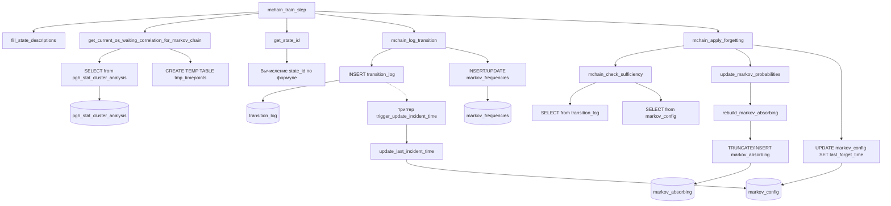

# Граф вызовов хранимых функций цепи Маркова

Ниже представлен граф вызовов для корневой функции `mchain_train_step()` и всех функций, участвующих в обучении цепи Маркова. Граф показывает иерархию вызовов (стрелки означают «вызывает»). Функции, вызываемые через `PERFORM` или внутри SQL-выражений, также включены.



**Примечания к графу**
- Пунктирная стрелка от `G` к `X` показывает, что триггер срабатывает автоматически при вставке в `transition_log`, а не вызывается явно.
- Функция `mchain_log_error` вызывается внутри блоков `EXCEPTION` в `mchain_train_step`, `mchain_apply_forgetting` и других, но для упрощения графа она не показана (вызывается при ошибках).
- Функции `archive_markov_probabilities`, `mchain_snapshot_prev_week` и сервисные (`mchain_clean_*`, `mchain_update_baseline`, `mchain_refresh_os_stats`) не входят в основной поток обучения и вызываются отдельно по cron, поэтому на графе не отражены.

---

# Подробное описание корневой функции `mchain_train_step()`

## Назначение

`mchain_train_step()` – главная функция выполняет один шаг обучения цепи Маркова:

1. Получает текущие метрики производительности (корреляцию, тренды) из системы мониторинга.
2. Отображает эти метрики в дискретное состояние цепи (`state_id`).
3. Фиксирует переход из предыдущего состояния в текущее, обновляя частоты и журнал.
4. Сдвигает состояние в таблице `markov_chain` для следующего шага.
5. При необходимости (по истечении интервала) запускает процедуру адаптивного забывания.

Функция обеспечивает непрерывное обучение модели в реальном времени.

---

## Сигнатура

```sql
mchain_train_step() RETURNS TEXT
```

**Возвращаемое значение** – текстовая строка с диагностикой:
- `'Initial state saved'` – при первом запуске (цепь была пуста).
- `'Step completed'` – нормальное завершение шага.
- `'Error: cannot get metrics'` – ошибка получения метрик.
- `'Error: transition logging failed'` – ошибка при логировании перехода.
- `'Step completed but forgetting failed'` – забывание не удалось, но шаг выполнен.

---

## Пошаговая логика

### 1. Инициализация справочника состояний (однократно)

```sql
IF NOT EXISTS (SELECT 1 FROM state_descriptions) THEN
    PERFORM fill_state_descriptions();
END IF;
```

Если таблица `state_descriptions` пуста, заполняет её 189 комбинациями корреляции и трендов. Это делается один раз при первом вызове.

### 2. Получение текущих метрик производительности

```sql
SELECT * INTO curr_vals FROM get_current_os_waiting_correlation_for_markov_chain();
```

Функция `get_current_os_waiting_correlation_for_markov_chain()` обращается к таблице `pgh_stat_cluster_analysis` (аналитические данные производительности) и возвращает:
- `current_correlation` (REAL) – коэффициент корреляции Пирсона между операционной скоростью и временем ожидания за последний час.
- `current_os_trend` (SMALLINT) – тренд операционной скорости (-1, 0, +1) на основе линейной регрессии.
- `current_wait_trend` (SMALLINT) – тренд времени ожидания.

Вся логика получения метрик защищена блоком `BEGIN ... EXCEPTION`. При любой ошибке (например, отсутствие данных) вызывается `mchain_log_error()` и функция возвращает `'Error: cannot get metrics'`.

### 3. Проверка валидности метрик

```sql
IF new_correlation IS NULL OR new_os_trend IS NULL OR new_wait_trend IS NULL THEN 
    RETURN 'No metrics available';
END IF;
```

Если хотя бы одна метрика `NULL` (нет данных), шаг прерывается – модель не обновляется.

### 4. Преобразование метрик в `state_id`

```sql
curr_state := get_state_id(
    curr_vals.current_correlation,
    curr_vals.current_os_trend,
    curr_vals.current_wait_trend
);
```

Функция `get_state_id()` вычисляет идентификатор состояния по формуле:

```
state_id = round((round(r,1) + 1.0) / 0.1)::int * 9 + (os_trend + 1)*3 + (wait_trend + 1)
```

Результат – число от 0 до 188.

### 5. Получение предыдущего состояния из таблицы `markov_chain`

```sql
SELECT prev_correlation, prev_os_trend, prev_wait_trend,
       curr_correlation, curr_os_trend, curr_wait_trend
INTO chain_rec
FROM markov_chain LIMIT 1;
```

Таблица `markov_chain` всегда содержит одну строку – последнее зафиксированное состояние (текущее) и предыдущее.

**Случай первого запуска** (ещё нет данных):

```sql
IF chain_rec.curr_correlation IS NULL THEN
    DELETE FROM markov_chain;
    INSERT INTO markov_chain (curr_correlation, curr_os_trend, curr_wait_trend)
    VALUES (curr_vals.current_correlation, curr_vals.current_os_trend, curr_vals.current_wait_trend);
    RETURN 'Initial state saved';
END IF;
```

Просто сохраняем текущее состояние без перехода.

### 6. Определение предыдущего состояния (`prev_state`)

```sql
prev_state := get_state_id(
    chain_rec.curr_correlation,
    chain_rec.curr_os_trend,
    chain_rec.curr_wait_trend
);
```

Здесь `chain_rec.curr_*` – это состояние, которое **было текущим** на прошлой минуте. Теперь оно становится предыдущим для нового перехода.

### 7. Логирование перехода и обновление частот

```sql
PERFORM mchain_log_transition(prev_state, curr_state);
```

`mchain_log_transition()` выполняет:
- `INSERT INTO transition_log (ts, from_state, to_state) VALUES (now(), ...)`
- `INSERT INTO markov_frequencies ... ON CONFLICT DO UPDATE SET frequency = frequency + 1`

Вставка в `transition_log` вызывает триггер `trigger_update_incident_time`, который при попадании в аварийное состояние обновляет `markov_config.last_incident_time` (используется для адаптивного забывания).

При ошибке логирования вызывается `mchain_log_error()` и функция возвращает `'Error: transition logging failed'`.

### 8. Обновление текущей цепи Маркова

```sql
UPDATE markov_chain SET
    prev_correlation = curr_correlation,
    prev_os_trend    = curr_os_trend,
    prev_wait_trend  = curr_wait_trend,
    curr_correlation = curr_vals.current_correlation,
    curr_os_trend    = curr_vals.current_os_trend,
    curr_wait_trend  = curr_vals.current_wait_trend;
```

Предыдущее состояние заменяется старым текущим, а текущее обновляется новыми метриками.

### 9. Плановое забывание (по интервалу)

```sql
SELECT last_forget_time, interval_minute INTO cfg FROM markov_config LIMIT 1;

IF now() - cfg.last_forget_time >= MAKE_INTERVAL(mins => cfg.interval_minute) THEN
    PERFORM mchain_apply_forgetting();
END IF;
```

`mchain_apply_forgetting()` применяет забывание (уменьшение всех частот на `(1 - alpha)`, где `alpha` может быть адаптивным или фиксированным). После успешного забывания обновляется `markov_config.last_forget_time`.

Если забывание вызвало ошибку, она логируется, но шаг обучения считается завершённым (возвращается `'Step completed but forgetting failed'`).

### 10. Завершение

```sql
RETURN 'Step completed';
```

---

## Взаимодействие с таблицами

| Таблица | Действие |
|---------|----------|
| `state_descriptions` | Чтение (при проверке существования) |
| `markov_chain` | Чтение и обновление одной строки |
| `transition_log` | Вставка нового перехода |
| `markov_frequencies` | Увеличение частоты перехода на 1 |
| `markov_config` | Чтение `last_forget_time`, `interval_minute`; обновляется только через `mchain_apply_forgetting()` |
| `pgh_stat_cluster_analysis` | Чтение (через `get_current_os_waiting_correlation_for_markov_chain`) |
| `mchain_error_log` | Вставка при ошибках |

---

## Обработка ошибок и устойчивость

- Все вызовы, которые могут завершиться ошибкой (получение метрик, логирование перехода, забывание), обёрнуты в отдельные блоки `BEGIN ... EXCEPTION`.
- Каждая ошибка записывается в `mchain_error_log` с полным контекстом (название функции, SQLSTATE, SQLERRM, параметры вызова).
- Ошибка в одном из этапов не прерывает выполнение всей функции полностью, кроме критической (например, отсутствие метрик). В большинстве случаев функция возвращает информативное сообщение, а модель продолжает работу на следующих шагах.

---

## Рекомендации по вызову

- **Частота вызова**: ровно раз в минуту. Если вызывать реже, модель будет пропускать переходы; если чаще – будут дублироваться переходы за одну минуту.
- **Настройка cron** (пример):
  ```cron
  * * * * * psql -d expecto_db -U expecto_user -c "SELECT mchain_train_step();"
  ```
- **Мониторинг**: полезно отслеживать возвращаемое значение функции (например, через отдельный лог), чтобы своевременно обнаружить проблемы с получением метрик.

---

## Пример вызова и результата

```sql
SELECT mchain_train_step();
```

Результат:
```
Step completed
```

При первом запуске:
```
Initial state saved
```

При отсутствии данных в `pgh_stat_cluster_analysis`:
```
No metrics available
```

---

## Влияние на производительность

`mchain_train_step()` выполняет:
- 1 запрос к `pgh_stat_cluster_analysis` (с временным окном 1 час, агрегации).
- Несколько простых INSERT/UPDATE в небольшие таблицы.
- Один раз в `interval_minute` минут (по умолчанию 30) – дополнительную процедуру забывания, которая обходит все строки `markov_frequencies` (максимум 189×189 = 35721 запись). Это допустимо даже на больших нагрузках.

Таким образом, функция лёгкая и не создаёт значительной нагрузки на СУБД.

---

## Заключение

`mchain_train_step()` – центральный элемент автоматического обучения модели. Она **не требует ручного вмешательства** после настройки, работает в фоне и постепенно выстраивает вероятностную картину переходов между состояниями производительности. Интеграция с адаптивным забыванием и логгированием ошибок делает систему самовосстанавливающейся и пригодной для длительной эксплуатации без присмотра.
