# Реализация цепи Маркова для прогнозирования инцидентов производительности СУБД PostgreSQL 

## Граф вызовов функций

```mermaid
graph TD
  update_markov_frequency --> get_state_id
  log_transition_and_update --> get_state_id
  log_transition_and_update --> update_markov_frequency
  update_markov_probabilities --> rebuild_markov_absorbing
  predict_risk_1min --> get_current_os_waiting_correlation_for_markov_chain
  predict_risk_1min --> get_state_id
  predict_risk_k_diag --> get_current_os_waiting_correlation_for_markov_chain
  predict_risk_k_diag --> get_state_id
  snapshot_markov_prev_week --> archive_markov_probabilities
  check_kl_divergence --> get_stationary_distribution
  evaluate_training_sufficiency --> compare_brier_scores
  evaluate_training_sufficiency --> check_kl_divergence
  apply_forgetting --> update_markov_probabilities
  check_and_forget --> calculate_kl_divergence
  check_and_forget --> calculate_chi_squared
  check_and_forget --> get_os_deviation
  check_and_forget --> apply_forgetting
  emergency_forget --> apply_forgetting
  markov_chain_training --> fill_state_descriptions
  markov_chain_training --> apply_forgetting
  markov_chain_training --> get_current_os_waiting_correlation_for_markov_chain
  markov_chain_training --> get_state_id
  markov_chain_training --> log_transition_and_update

  class markov_chain_training highlight
  classDef highlight fill:#ffcccb,stroke:#f00,stroke-width:4px,color:#a00,font-weight:bold
```

## Корневая функция "markov_chain_training"

Вызывается при расчете ежеминутных данных операционной скорости и ожиданий в функции **performance_metrics**

## Настройка cron для цепи Маркова
```
# Основная процедура check_and_forget
*/15 * * * * psql -d expecto_db -U expecto_user  -c "SELECT check_and_forget()"

# Функция создания/обновления снимка матрицы прошлой недели
5 19 * * 5 psql -d expecto_db -U expecto_user  -c "SELECT snapshot_markov_prev_week();"

# Ежедневная очистка forecast_log в 01:30
30 1 * * * psql -d expecto_db -U expecto_user -c "SELECT clean_forecast_log()"

# Ежедневная очистка transition_log в 01:15
15 1 * * * psql -d expecto_db -U expecto_user -c "SELECT clean_transition_log()"

# Ежедневное обновление эталонного распределения состояний (в 01:00)
0 1 * * * psql -d expecto_db -U expecto_user -c "SELECT update_state_baseline()"

# Ежедневное обновление статистики операционной скорости (в 01:30)
30 1 * * * psql -d expecto_db -U expecto_user -c "SELECT refresh_os_stats()"

# Очистка архивных снимков матрицы (раз в неделю, в воскресенье в 02:00)
0 2 * * 0 psql -d expecto_db -U expecto_user -c "SELECT clean_markov_probabilities_archive()"

# Очистка check_state (ежедневно в 03:00)
0 3 * * * psql -d expecto_db -U expecto_user -c "SELECT clean_check_state()"

# Очистка forget_log (раз в месяц, например, 1-го числа в 04:00)
0 4 1 * * psql -d expecto_db -U expecto_user -c "SELECT clean_forget_log()"

#  Очистка журнала apply_forgetting_log (каждый день в 02:00):
0 2 * * * psql -d expecto_db -U expecto_user -c "SELECT clean_apply_forgetting_log();"
```
