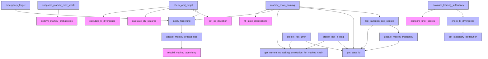

# Описание реализации цепи Маркова для пронозирования инцидентов производительности СУБД PostgreSQL 

## Граф вызовов функций

```mermaid
graph TD
  update_markov_frequency --> get_state_id
  log_transition_and_update --> get_state_id
  log_transition_and_update --> update_markov_frequency
  update_markov_probabilities --> rebuild_markov_absorbing
  predict_risk_1min --> get_current_os_waiting_correlation_for_markov_chain
  predict_risk_1min --> get_state_id
  predict_risk_k_diag --> get_current_os_waiting_correlation_for_markov_chain
  predict_risk_k_diag --> get_state_id
  snapshot_markov_prev_week --> archive_markov_probabilities
  check_kl_divergence --> get_stationary_distribution
  evaluate_training_sufficiency --> compare_brier_scores
  evaluate_training_sufficiency --> check_kl_divergence
  apply_forgetting --> update_markov_probabilities
  check_and_forget --> calculate_kl_divergence
  check_and_forget --> calculate_chi_squared
  check_and_forget --> get_os_deviation
  check_and_forget --> apply_forgetting
  emergency_forget --> apply_forgetting
  markov_chain_training --> fill_state_descriptions
  markov_chain_training --> apply_forgetting
  markov_chain_training --> get_current_os_waiting_correlation_for_markov_chain
  markov_chain_training --> get_state_id
  markov_chain_training --> log_transition_and_update

  style fill_state_descriptions fill:#f9f,stroke:#333
  style get_state_id fill:#bbf,stroke:#333
  style update_markov_frequency fill:#bbf,stroke:#333
  style log_transition_and_update fill:#bbf,stroke:#333
  style get_current_os_waiting_correlation_for_markov_chain fill:#bbf,stroke:#333
  style update_markov_probabilities fill:#bbf,stroke:#333
  style rebuild_markov_absorbing fill:#f9f,stroke:#333
  style predict_risk_1min fill:#bbf,stroke:#333
  style predict_risk_k_diag fill:#bbf,stroke:#333
  style snapshot_markov_prev_week fill:#bbf,stroke:#333
  style archive_markov_probabilities fill:#f9f,stroke:#333
  style get_stationary_distribution fill:#bbf,stroke:#333
  style check_kl_divergence fill:#bbf,stroke:#333
  style compare_brier_scores fill:#f9f,stroke:#333
  style evaluate_training_sufficiency fill:#bbf,stroke:#333
  style apply_forgetting fill:#bbf,stroke:#333
  style calculate_kl_divergence fill:#f9f,stroke:#333
  style calculate_chi_squared fill:#f9f,stroke:#333
  style get_os_deviation fill:#f9f,stroke:#333
  style check_and_forget fill:#bbf,stroke:#333
  style emergency_forget fill:#bbf,stroke:#333
  style markov_chain_training fill:#bbf,stroke:#333
```
