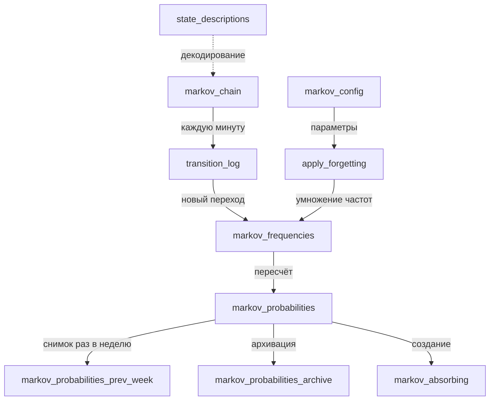

# Реализация цепи Маркова для прогнозирования инцидентов производительности PostgreSQL

## Общая концепция

Система моделирует производительность СУБД как **дискретную цепь Маркова** с конечным числом состояний. Каждое состояние кодирует тройку параметров:

- **Корреляция** – метрика нагрузки/производительности (округлённая до 0.1)
- **Тренд операционной скорости** (OS trend): -1 (падение), 0 (стабильно), +1 (рост)
- **Тренд времени ожидания** (wait trend): -1, 0, +1

Всего 189 состояний (0…188). Переходы между ними фиксируются в реальном времени. На основе накопленных частот вычисляются **вероятности переходов**, которые затем используются для:

- Краткосрочного прогноза состояния системы
- Расчёта многошагового риска через **поглощающие состояния** (аварийные)
- Обнаружения дрейфа модели (сравнение с недельным снимком)
- Адаптивного забывания устаревших наблюдений

---

## Таблицы конфигурации и управления

### `markov_config`

Хранит глобальные настройки обучения, забывания и адаптивности.

| Столбец | Тип | Описание |
|---------|-----|-----------|
| `last_forget_time` | TIMESTAMPTZ | Время последнего вызова планового забывания |
| `alpha` | REAL | Скорость забывания (при отключённом адаптивном режиме), по умолч. 0.1 |
| `interval_minute` | INT | Интервал между плановыми забываниями (мин), по умолч. 30 |
| `forecast_log_retention_days` | SMALLINT | Срок хранения прогнозов (21 день) |
| `transition_log_retention_days` | SMALLINT | Срок хранения переходов (21 день) |
| `adaptive_forgetting_enabled` | BOOLEAN | Глобальное разрешение забывания (по умолч. TRUE) |
| `archive_retention_days` | SMALLINT | Срок хранения архивных снимков матриц (21 день) |
| `use_adaptive_alpha` | BOOLEAN | Динамический alpha на основе времени с последнего инцидента |
| `base_alpha` | REAL | Базовый alpha при частых инцидентах (0.1) |
| `min_alpha` | REAL | Минимальный alpha при очень редких инцидентах (0.01) |
| `incident_half_life_days` | REAL | Период полураспада веса инцидента (дни), по умолч. 7 |
| `last_incident_time` | TIMESTAMPTZ | Время последнего аварийного перехода (обновляется триггером) |
| `apply_forgetting_log_retention_days` | INT | Срок хранения лога вызовов забывания (21) |
| `last_snapshot_date` | DATE | Дата последнего снимка матрицы (для сравнения) |
| `min_transitions_for_forgetting` | INT | Минимальное число переходов для активации забывания (5000) |

**Комментарий:** Адаптивный alpha вычисляется как  
`alpha = base_alpha * exp(-days_since_incident / half_life)`,  
но не меньше `min_alpha`. Если `adaptive_forgetting_enabled = false`, забывание не применяется.

---

## Таблицы частот и журналов

### `markov_frequencies`

Накопление сырых частот переходов между состояниями. Ядро модели, обновляется каждую минуту.

| Столбец | Тип | Описание |
|---------|-----|-----------|
| `from_state` | SMALLINT | Исходное состояние (0…188) |
| `to_state` | SMALLINT | Целевое состояние |
| `frequency` | REAL | Накопленная частота (может быть дробной после забывания) |

**Первичный ключ:** `(from_state, to_state)`

**Комментарий:** Частота увеличивается на 1 при каждом реальном переходе. При забывании все частоты умножаются на `(1 - alpha)`.

### `transition_log`

Журнал всех переходов с временными метками – используется для анализа, проверки достаточности данных и возможности переобучения.

| Столбец | Тип | Описание |
|---------|-----|-----------|
| `id` | BIGSERIAL | Первичный ключ |
| `ts` | TIMESTAMPTZ | Время перехода |
| `from_state` | SMALLINT | Исходное состояние |
| `to_state` | SMALLINT | Целевое состояние |

**Индексы:** `idx_transition_log_ts`, `idx_transition_log_from`, `idx_transition_log_ts_from`

### `apply_forgetting_log`

Журнал вызовов функции забывания – для аудита и отладки.

| Столбец | Тип | Описание |
|---------|-----|-----------|
| `id` | BIGSERIAL | Первичный ключ |
| `ts` | TIMESTAMPTZ | Время вызова |
| `effective_alpha` | REAL | Фактически применённый коэффициент |
| `adaptive_used` | BOOLEAN | Был ли включён адаптивный режим |
| `days_since_incident` | REAL | Дней с последнего инцидента (для адаптивного режима) |
| `alpha_override` | REAL | Если передан параметр alpha_override |
| `details` | TEXT | Детали расчёта alpha |

### `mchain_error_log`

Лог ошибок, возникающих при работе mchain-функций.

| Столбец | Тип | Описание |
|---------|-----|-----------|
| `id` | BIGSERIAL | Первичный ключ |
| `ts` | TIMESTAMPTZ | Время ошибки |
| `function_name` | TEXT | Имя функции |
| `error_message` | TEXT | Текст SQLERRM |
| `error_detail` | TEXT | Детали (SQLSTATE и пр.) |
| `error_hint` | TEXT | Подсказка |
| `context` | JSONB | Параметры вызова |

---

## Матрицы вероятностей

### `markov_probabilities`

Рассчитанная матрица условных вероятностей переходов:  
`P(to_state | from_state) = frequency(from_state, to_state) / sum(frequency(from_state, *))`

| Столбец | Тип | Описание |
|---------|-----|-----------|
| `from_state` | SMALLINT | Исходное состояние |
| `to_state` | SMALLINT | Целевое состояние |
| `probability` | REAL | Вероятность (0…1) |

**Первичный ключ:** `(from_state, to_state)`

### `markov_probabilities_prev_week`

Снимок матрицы `markov_probabilities` на момент последнего сравнения (обычно пятница, 19:05). Используется для расчёта стабильности модели (KL-дивергенция, χ² и т.д.).

Структура идентична `markov_probabilities`.

### `markov_probabilities_archive`

Архив матриц вероятностей с привязкой к дате обучения. Позволяет отслеживать долговременный дрейф.

| Столбец | Тип | Описание |
|---------|-----|-----------|
| `train_date` | DATE | Дата фиксации модели |
| `from_state` | SMALLINT | Исходное состояние |
| `to_state` | SMALLINT | Целевое состояние |
| `probability` | REAL | Вероятность |

**Первичный ключ:** `(train_date, from_state, to_state)`

### `markov_absorbing`

Модифицированная матрица для многошагового прогноза риска.  
Аварийные состояния (например, критическая корреляция) делаются **поглощающими**:  
`P(to_state | from_state) = 1`, если `to_state = from_state` (аварийный),  
иначе 0 для всех других переходов. Для неаварийных состояний вероятности остаются из `markov_probabilities`.

| Столбец | Тип | Описание |
|---------|-----|-----------|
| `from_state` | SMALLINT | Исходное состояние |
| `to_state` | SMALLINT | Целевое состояние |
| `probability` | REAL | Вероятность |

**Первичный ключ:** `(from_state, to_state)`

---

## Справочники и текущее состояние

### `state_descriptions`

Фиксированный справочник всех 189 состояний (заполняется функцией `fill_state_descriptions()`).

| Столбец | Тип | Описание |
|---------|-----|-----------|
| `state_id` | SMALLINT | Первичный ключ, от 0 до 188 |
| `correlation` | REAL | Коэффициент корреляции (округлён до 0.1) |
| `os_trend` | SMALLINT | Тренд OS: -1, 0, 1 |
| `wait_trend` | SMALLINT | Тренд ожидания: -1, 0, 1 |

### `markov_chain`

Хранит только одну строку – последнее и предпоследнее состояние системы для пошагового обучения.

| Столбец | Тип | Описание |
|---------|-----|-----------|
| `prev_correlation` | REAL | Предыдущее значение корреляции (до сдвига) |
| `prev_os_trend` | SMALLINT | Предыдущий тренд OS |
| `prev_wait_trend` | SMALLINT | Предыдущий тренд ожидания |
| `curr_correlation` | REAL | Текущее значение корреляции |
| `curr_os_trend` | SMALLINT | Текущий тренд OS |
| `curr_wait_trend` | SMALLINT | Текущий тренд ожидания |

**Комментарий:** Таблица **unlogged** – для высокой производительности, так как данные могут быть восстановлены из журналов.

---

## Дополнительные таблицы (упомянуты в схеме, но не детализированы)

В исходном файле также присутствуют объявления следующих таблиц (их структура не приведена, но они используются в полной версии):

- `forecast_log` – журнал прогнозов риска и фактических исходов (оценка качества модели)
- `state_baseline` – эталонное распределение состояний по часам и дням недели (для KL-дивергенции)
- `forget_log` – журнал форсированных забываний (причины, alpha, метрики)
- `operational_speed_stats` – средняя скорость и отклонение по часам (для обнаружения аномалий)
- `infrastructure_events` – регистрация внешних событий (деплой, сбой) для триггеров забывания
- `check_state` – история проверок срабатывания признаков (KL, χ², Brier, OS, инфраструктура)

---

## Взаимодействие таблиц в процессе работы модели



### Типовой цикл работы

1. **Наблюдение** – система каждую минуту считывает текущие метрики и определяет состояние (корреляция, OS trend, wait trend).
2. **Обновление цепи** – новое состояние записывается в `markov_chain`, старый `prev` сдвигается.
3. **Фиксация перехода** – пара `(prev_state, curr_state)` добавляется в `transition_log`, а частота в `markov_frequencies` инкрементируется на 1.
4. **Периодическое забывание** (каждые `interval_minute` минут):
   - Из `markov_config` читается `alpha` (адаптивный или фиксированный).
   - Если общее число переходов > `min_transitions_for_forgetting`, выполняется:
     ```sql
     UPDATE markov_frequencies SET frequency = frequency * (1 - alpha);
     ```
   - Вызов логируется в `apply_forgetting_log`.
5. **Пересчёт вероятностей** – после забывания или по требованию из `markov_frequencies` вычисляются `markov_probabilities`.
6. **Построение поглощающей матрицы** – на основе `markov_probabilities` и списка аварийных состояний создаётся `markov_absorbing` (обычно при каждом прогнозе).
7. **Многошаговый прогноз** – возведение `markov_absorbing` в степень n даёт вероятность попасть в аварию за n шагов.
8. **Мониторинг стабильности** – раз в неделю делается снимок `markov_probabilities` в `markov_probabilities_prev_week` и вычисляется KL-дивергенция с текущей матрицей. При превышении порога может быть инициировано форсированное забывание.
9. **Архивация** – еженедельно копия матрицы сохраняется в `markov_probabilities_archive` с меткой даты.

---

## Ключевые механизмы

### Забывание (Forgetting)

Устаревшие наблюдения постепенно теряют вес. Частоты умножаются на `(1 - alpha)`, где `alpha ∈ [0,1]`.  
**Адаптивный alpha** зависит от времени, прошедшего с последнего инцидента (аварийного перехода). Чем дольше без аварий, тем меньше alpha (модель забывает медленнее).

### Поглощающие состояния

Аварийные состояния (например, корреляция > 0.9 и негативные тренды) объявляются поглощающими. Это позволяет вычислить **вероятность достижения аварии** за заданное число шагов из текущего состояния. Используется как метрика риска.

### Сравнение с недельным снимком

Расхождение между текущей матрицей и снимком (KL-дивергенция > порога, χ² > порога) может сигнализировать о дрейфе распределения нагрузки и запускать адаптивное забывание.

### Журналы ошибок

Все ошибки в хранимых функциях `mchain_*` записываются в `mchain_error_log` с полным контекстом – для диагностики и восстановления.

---

## Резюме

Данная реализация цепи Маркова обеспечивает:

- **Адаптивность** к изменению паттернов производительности через забывание и динамический alpha.
- **Прогнозирование риска** через поглощающие состояния.
- **Аудит и воспроизводимость** через архивы матриц и журналы переходов.
- **Отказоустойчивость** – логирование ошибок и восстановление состояния из журналов.

Система может быть использована как часть автоматического мониторинга PostgreSQL для упреждающего обнаружения аварийных ситуаций.
